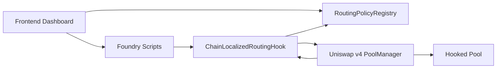
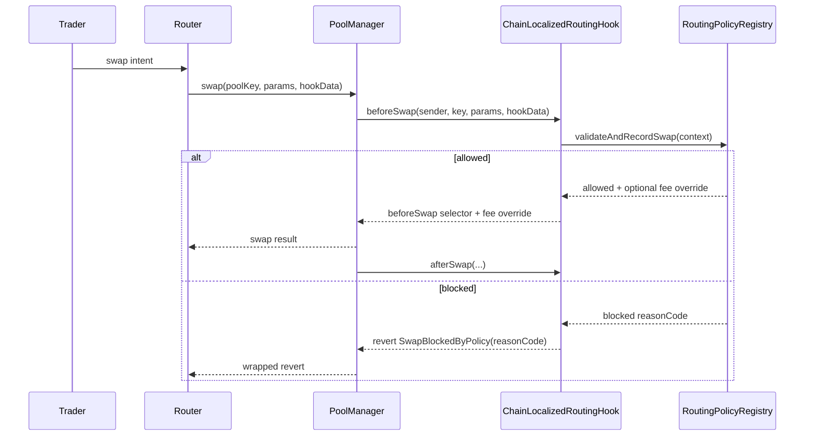
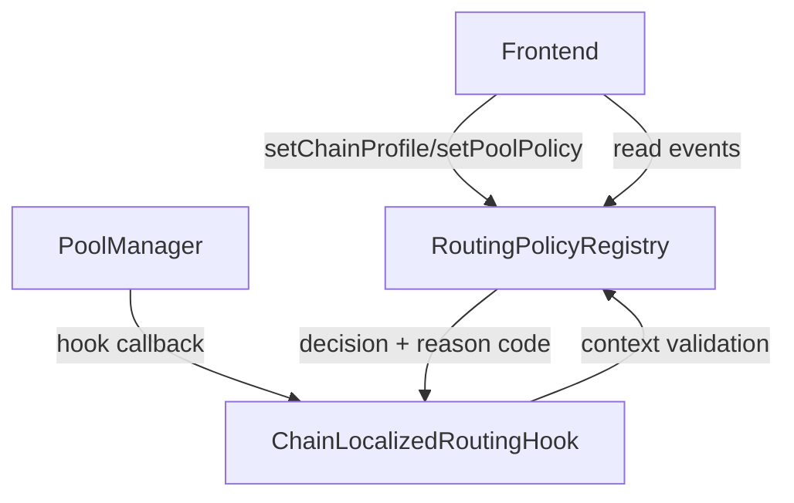

# Chain-Localized Routing Hook


A production-oriented Uniswap v4 hook monorepo for chain-localized routing and execution policies.

## Problem
Most routing behavior is offchain and global. This makes it hard to enforce deterministic, chain-specific market behavior directly at pool execution time.

## Solution
`ChainLocalizedRoutingHook` + `RoutingPolicyRegistry` enforce chain-localized execution policy in swap hooks (`beforeSwap`/`afterSwap`) with deterministic, onchain checks:

- swap size limits
- cooldown and swaps-per-block throttles
- router allowlists
- actor deny lists
- deterministic gas price ceiling checks
- optional dynamic fee override signaling for dynamic-fee pools

## Repo Layout
This repo uses root-level Foundry structure and a root-level frontend:

- `src/`, `test/`, `script/`, `lib/`
- `frontend/`
- `shared/` (ABIs + constants consumed by frontend)
- `docs/`, `assets/`, `context/`

## Architecture


## Swap Lifecycle


## Component Interaction


## Contracts
- `src/ChainLocalizedRoutingHook.sol`
- `src/RoutingPolicyRegistry.sol`
- `src/modules/LimitsModule.sol`
- `src/modules/FeePolicyModule.sol`

## Chain Profiles
Implemented profile model:

- `BASE`: higher throughput defaults and looser local routing constraints
- `OPTIMISM`: stricter amount and cooldown behavior
- `ARBITRUM`: allowlist-oriented mode with fee-adjustment support

Details: [docs/chain-profiles.md](docs/chain-profiles.md)

## Quickstart
1. Bootstrap and pin dependencies:
```bash
make bootstrap
```

2. Build and test:
```bash
make build
make test
```

3. Run profile demos locally:
```bash
make demo-local
make demo-profiles
```

4. Start frontend:
```bash
npm install
npm run dev --workspace frontend
```

## Testnet Demo
Run full testnet lifecycle (deploy/reuse addresses, configure profiles, print tx URLs):

```bash
make demo-testnet
```

Or run the unified workflow script directly:

```bash
./scripts/demo-workflow.sh --all
```

## Multi-Chain Deployment Pipeline (Production-Style)
Deploy/reuse hook + registry independently with per-chain RPC and infra address validation:

```bash
make deploy-multichain
```

Outputs:
- per-chain addresses written to `.env`:
  - `BASE_SEPOLIA_REGISTRY`, `BASE_SEPOLIA_HOOK_ADDRESS`
  - `OPTIMISM_SEPOLIA_REGISTRY`, `OPTIMISM_SEPOLIA_HOOK_ADDRESS`
  - `ARBITRUM_SEPOLIA_REGISTRY`, `ARBITRUM_SEPOLIA_HOOK_ADDRESS`
- deployment registry artifact:
  - `shared/constants/deployments.sepolia.json`
- tx hash + explorer URL logs per chain

Notes:
- Base Sepolia and Arbitrum Sepolia run by default with canonical v4 infra defaults sourced from `context/uniswap_docs/.../deployments.mdx`.
- Optimism Sepolia is disabled by default (`DEPLOY_OPTIMISM_SEPOLIA=false`) because the local context does not include canonical v4 infra defaults for `11155420`.
- To enable Optimism Sepolia deployment, set:
  - `DEPLOY_OPTIMISM_SEPOLIA=true`
  - `OPTIMISM_SEPOLIA_POOL_MANAGER_ADDRESS`
  - `OPTIMISM_SEPOLIA_POSITION_MANAGER_ADDRESS`
  - `OPTIMISM_SEPOLIA_UNIVERSAL_ROUTER_ADDRESS`

## Add a New Chain Profile
1. Extend `PolicyTypes.ChainProfile`.
2. Add profile logic in `RoutingPolicyRegistry.seedDefaultPolicy` and `FeePolicyModule`.
3. Add tests under `test/` for profile-specific allow/deny outcomes.
4. Update `shared/constants/chains.ts` and frontend selectors.
5. Update docs in `docs/chain-profiles.md`.

## Dependency Determinism
- Uniswap periphery pinned by `scripts/bootstrap.sh` to:
  - `3779387e5d296f39df543d23524b050f89a62917`
- Nested `v4-core`/`permit2` come from that pinned periphery commit.
- `scripts/verify_dependencies.sh` enforces pin + lockfile integrity.

## Assumptions
- `/context/uniswap` and `/context/atrium` were not populated in this checkout; pinned Uniswap sources in `lib/` were used as primary technical reference.
- Requirement text includes conflicting final commit targets (`300` and `58`); operational tooling defaults to `58` via `verify_commits.sh`.

## Documentation Index
- [docs/overview.md](docs/overview.md)
- [docs/architecture.md](docs/architecture.md)
- [docs/chain-profiles.md](docs/chain-profiles.md)
- [docs/policy-engine.md](docs/policy-engine.md)
- [docs/security.md](docs/security.md)
- [docs/deployment.md](docs/deployment.md)
- [docs/demo.md](docs/demo.md)
- [docs/api.md](docs/api.md)
- [docs/testing.md](docs/testing.md)
- [docs/frontend.md](docs/frontend.md)

## Security
See [SECURITY.md](SECURITY.md) and [docs/security.md](docs/security.md).
