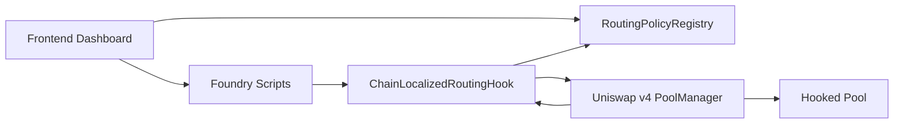
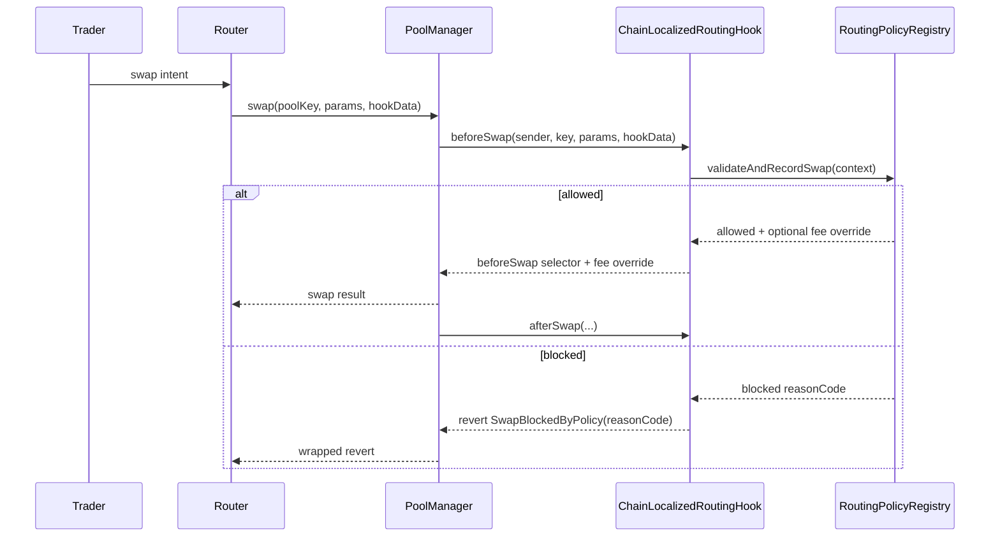
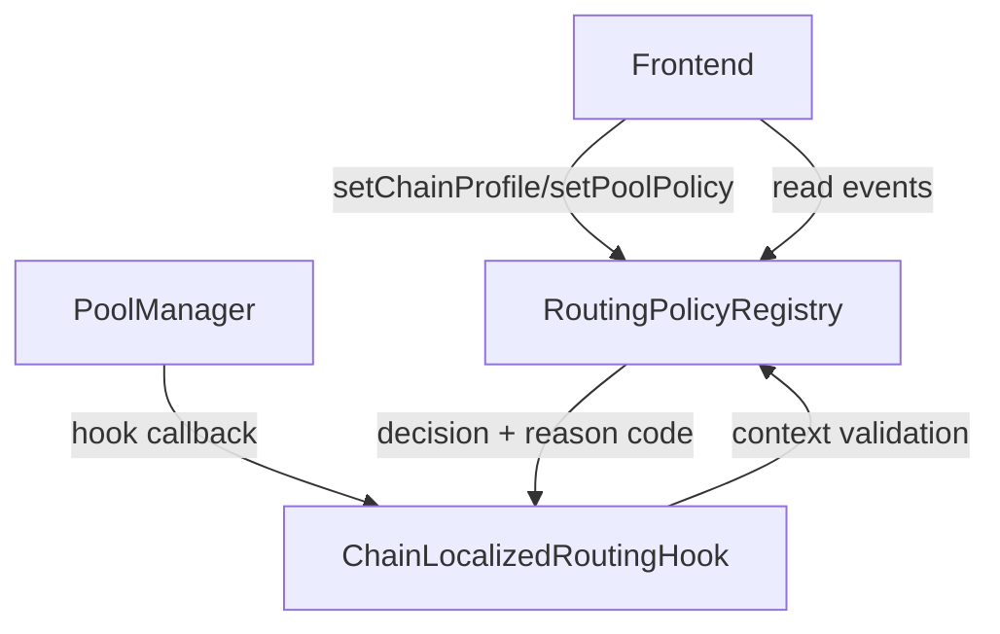

# Chain-Localized Routing Hook


A production-oriented Uniswap v4 hook monorepo for chain-localized routing and execution policies.

## Problem
Most routing behavior is offchain and global. This makes it hard to enforce deterministic, chain-specific market behavior directly at pool execution time.

## Solution
`ChainLocalizedRoutingHook` + `RoutingPolicyRegistry` enforce chain-localized execution policy in swap hooks (`beforeSwap`/`afterSwap`) with deterministic, onchain checks:

- swap size limits
- cooldown and swaps-per-block throttles
- router allowlists
- actor deny lists
- deterministic gas price ceiling checks
- optional dynamic fee override signaling for dynamic-fee pools

## Repo Layout
This repo uses root-level Foundry structure and a root-level frontend:

- `src/`, `test/`, `script/`, `lib/`
- `frontend/`
- `shared/` (ABIs + constants consumed by frontend)
- `docs/`, `assets/`, `context/`

## Architecture


## Swap Lifecycle


## Component Interaction


## Contracts
- `src/ChainLocalizedRoutingHook.sol`
- `src/RoutingPolicyRegistry.sol`
- `src/modules/LimitsModule.sol`
- `src/modules/FeePolicyModule.sol`

## Chain Profiles
Implemented profile model:

- `BASE`: higher throughput defaults and looser local routing constraints
- `OPTIMISM`: stricter amount and cooldown behavior
- `ARBITRUM`: allowlist-oriented mode with fee-adjustment support

Details: [docs/chain-profiles.md](docs/chain-profiles.md)

## Quickstart
1. Bootstrap and pin dependencies:
```bash
make bootstrap
```

2. Build and test:
```bash
make build
make test
```

3. Run profile demos locally:
```bash
make demo-local
make demo-profiles
```

4. Start frontend:
```bash
npm install
npm run dev --workspace frontend
```

## Testnet Demo
Run full testnet lifecycle using existing deployed addresses (configure profiles, print tx URLs, and show policy snapshots):

```bash
make demo-testnet
```

Or run the unified workflow script directly:

```bash
./scripts/demo-workflow.sh --all
```

## Multi-Chain Deployment Pipeline (Production-Style)
Deploy/reuse hook + registry independently with per-chain RPC and infra address validation:

```bash
make deploy-multichain
```

Outputs:
- per-chain addresses written to `.env`:
  - `BASE_SEPOLIA_REGISTRY`, `BASE_SEPOLIA_HOOK_ADDRESS`
  - `OPTIMISM_SEPOLIA_REGISTRY`, `OPTIMISM_SEPOLIA_HOOK_ADDRESS`
  - `ARBITRUM_SEPOLIA_REGISTRY`, `ARBITRUM_SEPOLIA_HOOK_ADDRESS`
  - `POLYGON_REGISTRY`, `POLYGON_HOOK_ADDRESS` (when funded)
- deployment registry artifact:
  - `shared/constants/deployments.multichain.json`
- tx hash + explorer URL logs per chain

Notes:
- Base Sepolia and Arbitrum Sepolia run by default with canonical v4 infra defaults sourced from `context/uniswap_docs/.../deployments.mdx`.
- Optimism Sepolia is disabled by default (`DEPLOY_OPTIMISM_SEPOLIA=false`) because the local context does not include canonical v4 infra defaults for `11155420`.
- Polygon mainnet is enabled (`DEPLOY_POLYGON=true`) and auto-skips when the deployer has zero MATIC.
- `MULTICHAIN_REUSE_ONLY=true` guarantees no new deployments and only reuses previously deployed addresses with onchain bytecode.
- To enable Optimism Sepolia deployment, set:
  - `DEPLOY_OPTIMISM_SEPOLIA=true`
  - `OPTIMISM_SEPOLIA_POOL_MANAGER_ADDRESS`
  - `OPTIMISM_SEPOLIA_POSITION_MANAGER_ADDRESS`
  - `OPTIMISM_SEPOLIA_UNIVERSAL_ROUTER_ADDRESS`

## Latest Multi-Chain Demo Outputs (March 11, 2026, 16:36 UTC)
Generated by:

```bash
./scripts/demo-workflow.sh --multi-chain
```

Base Sepolia (`84532`)
- `RoutingPolicyRegistry`: `0x5c544f279bd017ffbbc1d648b7fc0ffdd2fa3a91`
- `ChainLocalizedRoutingHook`: `0x96033de293f05177c3b9872f45aad3515a7980c0`
- Tx URLs:
  - [0x6ee764c425de83253f3122df89305233ae73a2aaf119338bd9dc8e32ec66c9f8](https://sepolia.basescan.org/tx/0x6ee764c425de83253f3122df89305233ae73a2aaf119338bd9dc8e32ec66c9f8)
  - [0x65d4759b2b566d7a3f495bac70a6b0d682f23c8e7e2b0ad929367dfce586866c](https://sepolia.basescan.org/tx/0x65d4759b2b566d7a3f495bac70a6b0d682f23c8e7e2b0ad929367dfce586866c)
  - [0x036dacfa4d02c47c7a1e39776be5e0fd35065142e5dccafa453825ae85a52620](https://sepolia.basescan.org/tx/0x036dacfa4d02c47c7a1e39776be5e0fd35065142e5dccafa453825ae85a52620)

Arbitrum Sepolia (`421614`)
- `RoutingPolicyRegistry`: `0x86e3ea2c1593a8d7aa84e872dd9c988d053a9ac9`
- `ChainLocalizedRoutingHook`: `0xd0c32eb387bfbb88d533d05edf03d1fe055080c0`
- Tx URLs:
  - [0xd85d80606656c73e6815219a8e145caae4e994e0e1c39120af1fb76c9740bb64](https://sepolia.arbiscan.io/tx/0xd85d80606656c73e6815219a8e145caae4e994e0e1c39120af1fb76c9740bb64)
  - [0x3563cedd31488ee8a3da63c38cf71da177398dbc219f077e44e388f2b0ea3fa7](https://sepolia.arbiscan.io/tx/0x3563cedd31488ee8a3da63c38cf71da177398dbc219f077e44e388f2b0ea3fa7)
  - [0xb450be477500506bf281056d56a1acdf04accf91cefc1171d9061e20c5eb40a3](https://sepolia.arbiscan.io/tx/0xb450be477500506bf281056d56a1acdf04accf91cefc1171d9061e20c5eb40a3)

Polygon (`137`)
- Status: skipped in demo because `DEMO_REUSE_ONLY=true` and no existing `POLYGON_REGISTRY`/`POLYGON_HOOK_ADDRESS` were present.

## Current Deployment Address Inventory
- Unichain Sepolia (`1301`):
  - `REGISTRY=0x30f358cb200bc849f220ee0caa9a1b2f44c0a7d6`
  - `HOOK_ADDRESS=0x1005b7776b0f86ff49c4da8c26fbefc12c6a00c0`
  - Tx URLs:
    - [0x4910a4036dc6e0c3b04aa584db9905308c30926556ff21aedf5513ec90aba4cc](https://sepolia.uniscan.xyz/tx/0x4910a4036dc6e0c3b04aa584db9905308c30926556ff21aedf5513ec90aba4cc)
    - [0x2cab4d971e97f5de2e339076aef0cb6298c280763577a461635691f3f430121d](https://sepolia.uniscan.xyz/tx/0x2cab4d971e97f5de2e339076aef0cb6298c280763577a461635691f3f430121d)
    - [0x5743e0d47f9204418e0599663219fe2d45c145144ba0ff352b2e3cbdc8cabf99](https://sepolia.uniscan.xyz/tx/0x5743e0d47f9204418e0599663219fe2d45c145144ba0ff352b2e3cbdc8cabf99)
- Base Sepolia (`84532`):
  - `BASE_SEPOLIA_REGISTRY=0x5c544f279bd017ffbbc1d648b7fc0ffdd2fa3a91`
  - `BASE_SEPOLIA_HOOK_ADDRESS=0x96033de293f05177c3b9872f45aad3515a7980c0`
- Arbitrum Sepolia (`421614`):
  - `ARBITRUM_SEPOLIA_REGISTRY=0x86e3ea2c1593a8d7aa84e872dd9c988d053a9ac9`
  - `ARBITRUM_SEPOLIA_HOOK_ADDRESS=0xd0c32eb387bfbb88d533d05edf03d1fe055080c0`
- Optimism Sepolia (`11155420`):
  - not deployed in this repo state (`OPTIMISM_SEPOLIA_REGISTRY` and `OPTIMISM_SEPOLIA_HOOK_ADDRESS` are unset)
- Polygon (`137`):
  - not deployed in this repo state (`POLYGON_REGISTRY` and `POLYGON_HOOK_ADDRESS` are unset)

## Add a New Chain Profile
1. Extend `PolicyTypes.ChainProfile`.
2. Add profile logic in `RoutingPolicyRegistry.seedDefaultPolicy` and `FeePolicyModule`.
3. Add tests under `test/` for profile-specific allow/deny outcomes.
4. Update `shared/constants/chains.ts` and frontend selectors.
5. Update docs in `docs/chain-profiles.md`.

## Dependency Determinism
- Uniswap periphery pinned by `scripts/bootstrap.sh` to:
  - `3779387e5d296f39df543d23524b050f89a62917`
- Nested `v4-core`/`permit2` come from that pinned periphery commit.
- `scripts/verify_dependencies.sh` enforces pin + lockfile integrity.

## Assumptions
- `/context/uniswap` and `/context/atrium` were not populated in this checkout; pinned Uniswap sources in `lib/` were used as primary technical reference.
- Requirement text includes conflicting final commit targets (`300` and `58`); operational tooling defaults to `58` via `verify_commits.sh`.
- Reactive Network is not integrated in this codebase; `REACTIVE_*` variables are intentionally not used in demo/deployment workflows.

## Documentation Index
- [docs/overview.md](docs/overview.md)
- [docs/architecture.md](docs/architecture.md)
- [docs/chain-profiles.md](docs/chain-profiles.md)
- [docs/policy-engine.md](docs/policy-engine.md)
- [docs/security.md](docs/security.md)
- [docs/deployment.md](docs/deployment.md)
- [docs/demo.md](docs/demo.md)
- [docs/api.md](docs/api.md)
- [docs/testing.md](docs/testing.md)
- [docs/frontend.md](docs/frontend.md)

## Security
See [SECURITY.md](SECURITY.md) and [docs/security.md](docs/security.md).
