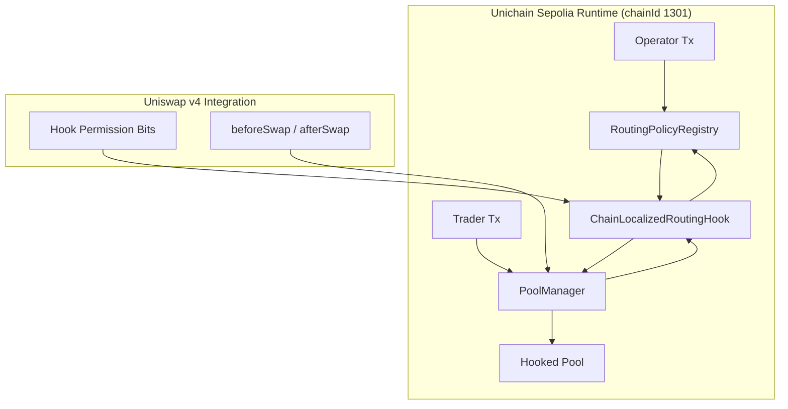
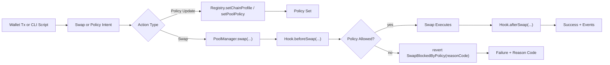
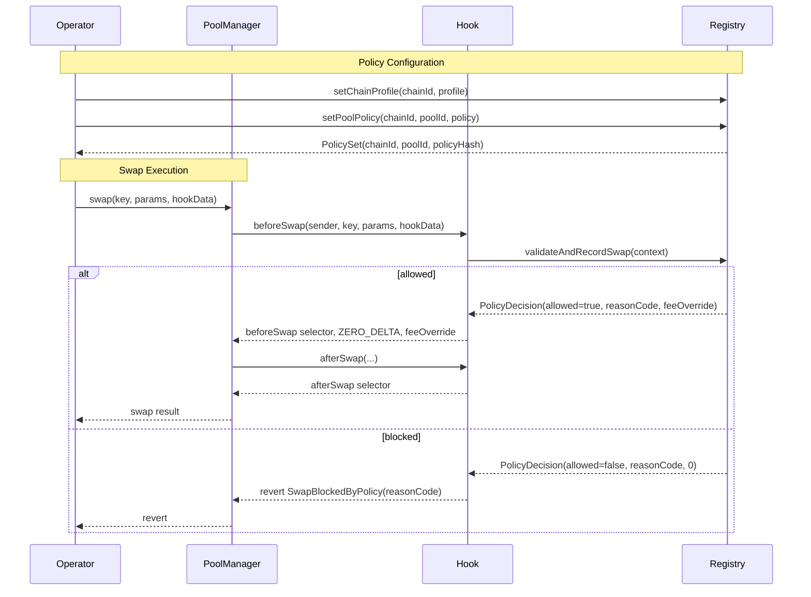
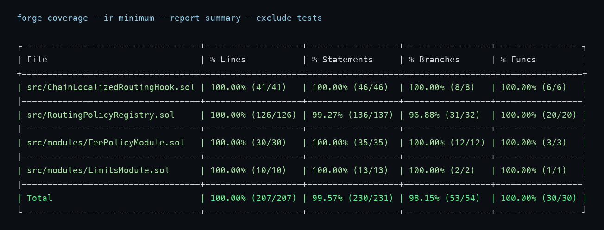

# Chain-Localized Routing Hook
**Built on Uniswap v4 · Deployed on Unichain Sepolia × Base Sepolia × Arbitrum Sepolia**

_Targeting: Uniswap Foundation Prize · Unichain Prize_

> A Uniswap v4 hook that enforces deterministic chain-localized routing policies directly in swap execution.


## The Problem
Routers and integrators often apply chain-aware logic offchain, but pool execution remains globally generic. That mismatch means local constraints (gas, cooldowns, allowlists, execution caps) are not enforced at the final settlement boundary.

| Layer | Failure Mode |
|---|---|
| Router Layer | Pathing logic can ignore chain-specific execution constraints at settlement time. |
| Pool Layer | Static behavior cannot apply per-chain policy differences during a swap callback. |
| Security Layer | Router and actor controls are not enforced in a deterministic onchain gate. |
| Operations Layer | Policy changes lack a canonical reason-coded proof chain tied to swap execution. |

The consequence is measurable execution drift and inconsistent policy enforcement across chains, even when integrators intend chain-specific behavior.

## The Solution
The system enforces policy at the hook callback boundary, where swap settlement is decided.

1. `PoolManager` calls the hook `beforeSwap`.
2. The hook builds a deterministic `SwapContext` from onchain values (`chainId`, `poolId`, price, liquidity, gas price, router/trader context).
3. The hook calls `RoutingPolicyRegistry.validateAndRecordSwap(context)`.
4. The registry evaluates policy checks in fixed order and returns `PolicyDecision` with `allowed/reasonCode/feeOverride`.
5. The hook either reverts with `SwapBlockedByPolicy(reasonCode)` or returns `BeforeSwapDeltaLibrary.ZERO_DELTA` plus optional fee override.
6. Registry and hook emit reason-coded events for replayable verification.

Core insight: policy must be enforced inside `beforeSwap`, not inferred offchain after routing decisions.

## Architecture

### Component Overview
```text
src/
  ChainLocalizedRoutingHook.sol           # Uniswap v4 callback gate; builds swap context; allows/blocks swaps
  RoutingPolicyRegistry.sol               # Chain profile + per-pool policy engine; reason-coded decisions
  modules/
    FeePolicyModule.sol                   # Dynamic fee override computation with v4 override flag
    LimitsModule.sol                      # Deterministic approximate price-impact guard
  libraries/
    PolicyTypes.sol                       # Shared enums/structs for profiles, policies, contexts, decisions
  interfaces/
    IRoutingPolicyRegistry.sol            # Hook-to-registry interface and canonical policy events
```

### Architecture Flow (Subgraphs)


### User Perspective Flow


### Interaction Sequence


## Policy Engine Modes
| Mode | Trigger | Deterministic Checks | Typical Outcome |
|---|---|---|---|
| BASE | `setChainProfile(chainId, BASE)` | max amount, gas ceiling, impact, optional cooldown/swap cap | Throughput-oriented policy envelope |
| OPTIMISM | `setChainProfile(chainId, OPTIMISM)` | tighter amount/cooldown/swap cap + optional dynamic fee | Stricter execution policy |
| ARBITRUM | `setChainProfile(chainId, ARBITRUM)` | allowlist-oriented path + dynamic fee response | Router-scoped execution policy |

`policy.enabled=false` is intentionally non-blocking: swaps are allowed with reason code `POLICY_DISABLED`, preserving deterministic observability without forcing reverts.

## Deployed Contracts

### Unichain Sepolia (chainId: 1301)
| Contract | Address |
|---|---|
| RoutingPolicyRegistry | [0x30f358cb200bc849f220ee0caa9a1b2f44c0a7d6](https://sepolia.uniscan.xyz/address/0x30f358cb200bc849f220ee0caa9a1b2f44c0a7d6) |
| ChainLocalizedRoutingHook | [0x1005b7776b0f86ff49c4da8c26fbefc12c6a00c0](https://sepolia.uniscan.xyz/address/0x1005b7776b0f86ff49c4da8c26fbefc12c6a00c0) |

### Base Sepolia (chainId: 84532)
| Contract | Address |
|---|---|
| RoutingPolicyRegistry | [0x5c544f279bd017ffbbc1d648b7fc0ffdd2fa3a91](https://sepolia.basescan.org/address/0x5c544f279bd017ffbbc1d648b7fc0ffdd2fa3a91) |
| ChainLocalizedRoutingHook | [0x96033de293f05177c3b9872f45aad3515a7980c0](https://sepolia.basescan.org/address/0x96033de293f05177c3b9872f45aad3515a7980c0) |

### Arbitrum Sepolia (chainId: 421614)
| Contract | Address |
|---|---|
| RoutingPolicyRegistry | [0x86e3ea2c1593a8d7aa84e872dd9c988d053a9ac9](https://sepolia.arbiscan.io/address/0x86e3ea2c1593a8d7aa84e872dd9c988d053a9ac9) |
| ChainLocalizedRoutingHook | [0xd0c32eb387bfbb88d533d05edf03d1fe055080c0](https://sepolia.arbiscan.io/address/0xd0c32eb387bfbb88d533d05edf03d1fe055080c0) |

## Live Demo Evidence
Demo run date: March 11, 2026 (UTC).

### Phase 1 — Deployment Reuse Verification
Network: Unichain Sepolia (1301)

| Action | Transaction |
|---|---|
| Deploy `RoutingPolicyRegistry` | [0x4910a403…](https://sepolia.uniscan.xyz/tx/0x4910a4036dc6e0c3b04aa584db9905308c30926556ff21aedf5513ec90aba4cc) |
| Deploy `ChainLocalizedRoutingHook` (CREATE2) | [0x2cab4d97…](https://sepolia.uniscan.xyz/tx/0x2cab4d971e97f5de2e339076aef0cb6298c280763577a461635691f3f430121d) |
| Authorize hook in registry | [0x5743e0d4…](https://sepolia.uniscan.xyz/tx/0x5743e0d47f9204418e0599663219fe2d45c145144ba0ff352b2e3cbdc8cabf99) |

### Phase 2 — BASE Profile Policy
Network: Unichain Sepolia (1301)

| Action | Transaction |
|---|---|
| `setChainProfile(..., BASE)` | [0x2fa276b3…](https://sepolia.uniscan.xyz/tx/0x2fa276b336eaec71f307f53f86c4c8b6cd7b0b1d558e5c271ef2400b475d79d1) |
| `setPoolPolicy(..., BASE policy)` | [0x00ee6b2b…](https://sepolia.uniscan.xyz/tx/0x00ee6b2bfcf531fa6414091f09387ce9aa8e3df4a6c314397ee6e6ddbe2ddee5) |

### Phase 3 — OPTIMISM Profile Policy
Network: Unichain Sepolia (1301)

| Action | Transaction |
|---|---|
| `setChainProfile(..., OPTIMISM)` | [0x11a6f955…](https://sepolia.uniscan.xyz/tx/0x11a6f955c1e1eadb846cbdf7103cbcc5ecb64217b6134201d48e4ed14d37de50) |
| `setPoolPolicy(..., OPTIMISM policy)` | [0x9899021a…](https://sepolia.uniscan.xyz/tx/0x9899021ad49708a2054d013eff4064077f93d54a0ad43541f1360e402a3b4611) |

### Phase 4 — ARBITRUM Profile Policy
Network: Unichain Sepolia (1301)

| Action | Transaction |
|---|---|
| `setChainProfile(..., ARBITRUM)` | [0x3d8ff503…](https://sepolia.uniscan.xyz/tx/0x3d8ff503c01241fbcb009cc61603d3386e2639d18374c060e05d3a89a3acf1e1) |
| `setPoolPolicy(..., ARBITRUM policy)` | [0xce3bb11f…](https://sepolia.uniscan.xyz/tx/0xce3bb11fce50b416d1266ddd4968d5bb827aaa8bbcc82850050671ea7b325635) |

### Phase 5 — Router/Actor List Mutations
Network: Unichain Sepolia (1301)

| Action | Transaction |
|---|---|
| `setRouterAllowlist(..., true)` | [0x7a693891…](https://sepolia.uniscan.xyz/tx/0x7a693891466707f4bbc86e5748a7b8f68056406ea75030e6c51f959534d9c965) |
| `setActorDenylist(..., true)` | [0x416d603c…](https://sepolia.uniscan.xyz/tx/0x416d603c8316e6711e24442dbc93472a6dcb8288bb0591e780d1d250c61087f5) |
| `setActorDenylist(..., false)` | [0x82c172a9…](https://sepolia.uniscan.xyz/tx/0x82c172a95c2660b03319075e32a0816d8646de72af2d17ee781b85c6b8f36c6c) |

### Phase 6 — Multi-Network Deployment Proof
Network: Base Sepolia (84532)

| Action | Transaction |
|---|---|
| Deploy `RoutingPolicyRegistry` | [0x6ee764c4…](https://sepolia.basescan.org/tx/0x6ee764c425de83253f3122df89305233ae73a2aaf119338bd9dc8e32ec66c9f8) |
| Deploy `ChainLocalizedRoutingHook` | [0x65d4759b…](https://sepolia.basescan.org/tx/0x65d4759b2b566d7a3f495bac70a6b0d682f23c8e7e2b0ad929367dfce586866c) |

Network: Arbitrum Sepolia (421614)

| Action | Transaction |
|---|---|
| Deploy `RoutingPolicyRegistry` | [0xd85d8060…](https://sepolia.arbiscan.io/tx/0xd85d80606656c73e6815219a8e145caae4e994e0e1c39120af1fb76c9740bb64) |
| Deploy `ChainLocalizedRoutingHook` | [0x3563cedd…](https://sepolia.arbiscan.io/tx/0x3563cedd31488ee8a3da63c38cf71da177398dbc219f077e44e388f2b0ea3fa7) |

> The demo script also reads state with `cast call` (`getChainProfile`, `getPoolPolicy`) and prints those snapshots off-chain for independent cross-checking.

## Running the Demo
```bash
# Run full proof sequence (local proof + testnet policy transaction flow)
./scripts/demo-workflow.sh --all
```

```bash
# Run testnet proof only with existing deployed contracts
./scripts/demo-workflow.sh --testnet

# Print multi-network deployment registry and tx evidence
./scripts/demo-workflow.sh --multi-chain
```

```bash
# Run local deterministic proof suite only
./scripts/demo-workflow.sh --local
```

## Test Coverage
```text
Lines:       100.00% (207/207)
Statements:   99.57% (230/231)
Branches:     98.15% (53/54)
Functions:   100.00% (30/30)
```

```bash
forge coverage --ir-minimum --report summary --exclude-tests
```



- `unit`: hook decoding, access control, policy checks, module behavior.
- `edge`: amount/cooldown/swaps-per-block boundaries and invalid policy bounds.
- `fuzz`: randomized gas ceiling and max amount bypass resistance.
- `invariant`: max amount rule monotonic enforcement under arbitrary calls.
- `integration`: profile lifecycle outcome changes on a hooked pool path.

## Repository Structure
```text
.
├── src/
├── scripts/
├── test/
└── docs/
```

## Documentation Index
| Doc | Description |
|---|---|
| `docs/overview.md` | Project scope and deterministic enforcement goal. |
| `docs/architecture.md` | Contract roles, callback flow, and invariants. |
| `docs/chain-profiles.md` | Base/Optimism/Arbitrum profile differences. |
| `docs/policy-engine.md` | Evaluation order, reason codes, policy model. |
| `docs/security.md` | Threat model, mitigations, residual risk. |
| `docs/deployment.md` | Bootstrap and deployment workflow details. |
| `docs/demo.md` | Demo modes and proof process. |
| `docs/api.md` | Key external/public contract interfaces. |
| `docs/testing.md` | Test matrix and reproducible commands. |

## Key Design Decisions

**Why split hook and registry instead of a monolith?**  
The hook executes on the Uniswap callback boundary and should stay minimal for correctness and gas clarity. Policy state and admin surfaces are isolated in `RoutingPolicyRegistry`, making trust boundaries explicit and easier to test. A monolith would couple callback-critical logic with governance mutation paths.

**Why use deterministic onchain signals (`tx.gasprice`, chain profile mappings) instead of offchain oracles?**  
Core enforcement must not depend on external data availability or signer freshness. `tx.gasprice`, `chainId`, and onchain policy storage give deterministic behavior under the EVM execution model. This reduces liveness dependencies and preserves reproducible transaction-level evidence.

**Why key policy by `(chainId, poolId)` and keep reason codes explicit?**  
The same pool design can intentionally behave differently on different chains without duplicate contracts. `(chainId, poolId)` keying prevents policy collisions and makes multi-chain replay analysis straightforward. Reason-coded events provide a forensic trail for each allow/block decision.

## Roadmap
- [ ] Add explicit timelock governance path for policy updates.
- [ ] Add CI gate for coverage enforcement in workflow.
- [ ] Add profile templates for additional L2 deployments.
- [ ] Add stronger formal property checks for fee override bounds.
- [ ] Add production monitoring package for policy event analytics.

## License
MIT
