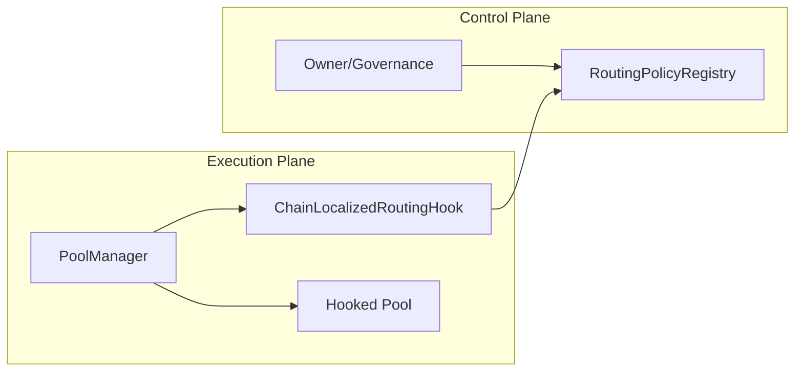
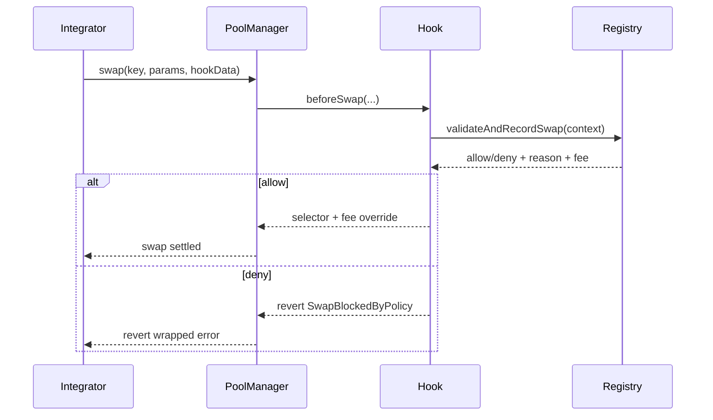
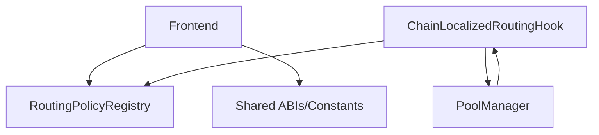

# Spec: Chain-Localized Routing Hook

## Objective
Create a Uniswap v4 hook-based primitive where swap behavior is enforceably localized by chain policy, fully deterministic on-chain, and configurable per pool.

## Scope
- Hook entrypoint enforcement and policy checks in `beforeSwap`.
- Chain-aware policy registry with profile mapping and per-pool policy storage.
- Demo-ready profile differences for Base, Optimism, and Arbitrum.
- Foundry-first test suite (unit + edge + fuzz + invariant + integration).
- Frontend for profile selection and policy writes.

## System Components
- `ChainLocalizedRoutingHook`
  - Implements swap core hook functions (`beforeSwap`, `afterSwap`).
  - Enforces `onlyPoolManager` via `BaseHook`.
  - Builds deterministic swap context from pool state and swap params.
  - Calls registry for decision and reverts on denied swaps.
- `RoutingPolicyRegistry`
  - Stores `chainId -> ChainProfile`.
  - Stores `chainId + poolId -> PoolPolicy`.
  - Stores per-pool router allowlists and actor deny lists.
  - Emits standardized policy and decision events.
- `LimitsModule`
  - Deterministic approximate price impact function from current/limit sqrt price.
- `FeePolicyModule`
  - Optional fee override computation for dynamic fee pools.

## Data Model
`PoolPolicy` fields:
- `enabled`
- `maxAmountIn`
- `maxPriceImpactBps`
- `cooldownSeconds`
- `maxSwapsPerBlock`
- `enforceRouterAllowlist`
- `enforceActorDenylist`
- `dynamicFeeEnabled`
- `baseFee`
- `gasPriceCeilingWei`

## Decision Pipeline
1. Hook receives `beforeSwap`.
2. Hook derives `poolId`, reads slot0/liquidity, decodes router/trader context.
3. Hook calls `validateAndRecordSwap(context)`.
4. Registry applies policy checks in deterministic order.
5. Registry emits `SwapAllowed` or `SwapBlocked`.
6. Hook returns selector (+ optional override fee) or reverts `SwapBlockedByPolicy`.

## Profile Design
- Base profile
  - Higher `maxSwapsPerBlock`
  - Low/no cooldown
  - Liquidity-derived max amount defaults
- Optimism profile
  - Lower max amount and stricter rate limiting
  - Optional fee adjustment under configured thresholds
- Arbitrum profile
  - Router allowlist orientation
  - Congestion-like fee adjustment path for dynamic-fee pools

## Security Model
Trust assumptions:
- PoolManager correctness is trusted (Uniswap v4 core invariant).
- Traders/routers are adversarial.
- Registry owner/governance can change policy and is trusted within documented limits.

Key controls:
- Hook entrypoints restricted to PoolManager.
- Registry mutate operations restricted to owner.
- Registry swap validation restricted to authorized hook addresses.
- Max bounds for cooldown, impact, and swaps-per-block prevent extreme misconfiguration.

## Event Schema
- `PolicySet(chainId, poolId, policyHash)`
- `SwapAllowed(chainId, poolId, trader, reasonCode)`
- `SwapBlocked(chainId, poolId, trader, reasonCode)`
- `RouterAllowlistUpdated(chainId, router, allowed)`

## Diagrams

## Reproducibility
Dependency pin strategy:
- `scripts/bootstrap.sh` pins `lib/v4-periphery` to commit `3779387e5d296f39df543d23524b050f89a62917`.
- Nested submodules are initialized recursively.
- CI runs `scripts/verify_dependencies.sh`.

## Non-Goals
- Universal offchain router replacement.
- Nondeterministic offchain market-condition enforcement.
